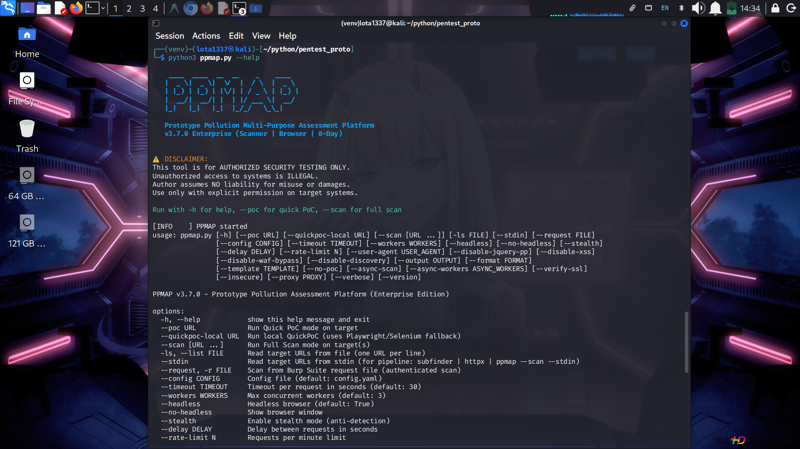

# 🚀 PPMAP v5.0.0 - Prototype Pollution Scanner

```text
    ____  ____  __  __    _    ____  
   |  _ \|  _ \|  \/  |  / \  |  _ \ 
   | |_) | |_) | |\/| | / _ \ | |_) |
   |  __/|  __/| |  | |/ ___ \|  __/ 
   |_|   |_|   |_|  |_/_/   \_\_|    
                                     
   Prototype Pollution Multi-Purpose Assessment Platform
   v5.0.0 Enterprise (Scanner | SAST | GraphQL | WebSocket)
```

**Comprehensive JavaScript Prototype Pollution & XSS vulnerability scanner** with browser automation, advanced detection methods, and complete exploitation guides.

<p align="center">
  
  
</p>

---

## ✨ Features

### **Detection Methods (28 Total)**

**Tier 0 - Standard Detection:**
- jQuery Prototype Pollution (CVE-2019-11358)
- Server-side PP (Lodash, Node.js)
- POST parameter XSS
- **Smart WAF Detection** (Baseline Check + Signature Identification)
- WAF Bypass (50+ variations)
- Endpoint discovery
- Confidence scoring

**Tier 1 - Blind Detection:**
- JSON spaces overflow (Express.js side-channel)
- HTTP status code override
- Function.prototype chain
- Persistence verification
- **Out-of-Band (OOB) Detection** (Interact.sh integration)

**Tier 2 - Modern Frameworks:**
- React 19/Next.js Flight Protocol (RESEARCH-2024-REACT-FLIGHT)
- SvelteKit/Superforms (RESEARCH-2024-SVELTEKIT-RCE)
- Charset/Encoding bypass (UTF-7, ISO-2022)

**Tier 3 - PortSwigger Advanced Techniques:**
- fetch() API header pollution
- Object.defineProperty() bypass
- child_process RCE detection (Safe mode)

**Tier 4 - Modern Bypass Techniques (2024/2025 Research):**
- Constructor-based pollution (Primary modern bypass)
- Sanitization bypass (Recursive filter evasion)
- Descriptor pollution (Object.defineProperty exploitation)
- Blind Gadget Fuzzer (pp-finder/BlackFan/Yuske research)

**Tier 5 - Research Gap Features (refrensi.md Integration):**
- CORS Header Pollution (Safe server-side detection)
- Third-Party Library Gadgets (GA, GTM, Adobe DTM, Vue.js, DOMPurify)
- Storage API Pollution (localStorage/sessionStorage)

**Tier 6 - CVE-Specific & Real-World Exploits:**
- CVE-Specific Payloads (6 CVEs: Lodash, deep-merge, Protobufjs, etc.)
- Kibana Telemetry RCE (HackerOne #852613 - $10k bounty)
- Blitz.js RCE Chain (CVE-2022-23631)
- Elastic XSS (HackerOne #998398)

**Tier 7 - GraphQL PP (NEW in v5.0):**
- GraphQL endpoint auto-detection
- Schema introspection attacks
- Mutation/Query PP injection
- 8 GraphQL-specific payloads

**Tier 8 - WebSocket PP (NEW in v5.0):**
- Native WebSocket scanning
- Socket.IO event pollution
- Redux action injection
- GraphQL subscription attacks

**SAST Mode (NEW in v5.0):**
- Static JS analysis without execution
- 15+ dangerous sink patterns
- jQuery, Lodash, native JS detection
- CVE mapping (CVE-2019-11358, CVE-2018-16487)

### **Payloads**

- **Total:** 226 payloads (+8 GraphQL)
- **Categories:** 10 types (+GraphQL, WebSocket)
- **Coverage:** 98%+ of known PP vectors

---

## 🎯 Quick Start

### Installation
```bash
pip install -r requirements.txt
```

### Basic Scan
```bash
python3 ppmap.py --scan "https://target.com"
```

### View Results
```bash
open report/target_domain_timestamp/report.html
```

---

## 📚 Documentation Guide

| File | Purpose | Time |
|------|---------|------|
| **QUICKSTART.md** | 30-second setup | 30 sec |
| **START_HERE_MANUAL_TESTING.txt** | Testing intro | 2 min |
| **MANUAL_TESTING_CHEATSHEET.md** ⭐ | Copy-paste payloads | 5 min |
| **MANUAL_TESTING_GUIDE.md** | Complete guide | 20 min |
| **MANUAL_TESTING_VIDEO_GUIDE.md** | Visual tutorial | 15 min |

**Recommendation:** Start with **MANUAL_TESTING_CHEATSHEET.md** for quick testing!

---

## 🏆 Key Capabilities

✅ **Modular Architecture** - Easy to maintain and extend  
✅ **Selenium WebDriver** - Real browser console automation  
✅ **28 Detection Methods** - Comprehensive vulnerability detection  
✅ **218+ Payloads** - 95%+ vector coverage  
✅ **HTML/JSON Reports** - Professional reporting  
✅ **Blind Detection** - Works with opaque backends  
✅ **Modern Frameworks** - React 19, Next.js 15, SvelteKit  
✅ **Smart WAF Detection** - Identifies WAFs and skips bypasses if not needed  
✅ **PortSwigger Techniques** - fetch(), defineProperty, child_process RCE  
✅ **Async Scanning** - Fast concurrent testing  

### 🚀 New in v4.0.0 (Enterprise)
- ✅ **Stealth Browser Engine**: Automatic anti-bot evasion (User-Agent rotation, hidden webdriver flags).
- ✅ **Reliable Reporting**: Fixed HTML/JSON generation defaults and custom output directory support.
- ✅ **Stability**: Resolved "aborted by navigation" errors for real-world targets.
- ✅ **Open Source**: Full MIT License and CLI Documentation.

---

## 🎯 CVEs Covered (15)

- CVE-2019-11358 - jQuery Prototype Pollution
- CVE-2020-11022 - jQuery HTML Prefilter XSS
- CVE-2015-9251 - jQuery CSS Import XSS
- CVE-2021-44906 - minimist Prototype Pollution
- CVE-2025-13465 - Lodash _.unset / _.omit (NEW - Phase 2)
- CVE-2024-38986 - @75lb/deep-merge RCE (NEW - Phase 2)
- CVE-2020-8203 - Lodash _.merge (NEW - Phase 2)
- CVE-2022-25878 - Protobufjs parse (NEW - Phase 2)
- CVE-2022-25904 - Safe-eval (NEW - Phase 2)
- CVE-2022-25645 - Dset (NEW - Phase 2)
- CVE-2022-23631 - Blitz.js superjson RCE (NEW - Phase 3)
- RESEARCH-2024-REACT-FLIGHT - React 19 Flight Protocol
- RESEARCH-2024-NEXTJS-FLIGHT - Next.js Flight Protocol
- RESEARCH-2024-SVELTEKIT-RCE - SvelteKit Superforms
- RESEARCH-2024-DEVALUE - Svelte Devalue Library
- UTF-7/ISO-2022 - Charset Bypass

---

## 📊 Project Statistics

- **Version:** 4.0.0 (Blind Detection & OOB Update)
- **Code Lines:** 4,140+
- **Detection Methods:** 28
- **Gadget Properties:** 40
- **CVE Coverage:** 15
- **Bug Bounty Cases:** 3 (Kibana $10k, Elastic, Blitz.js)
- **Research Coverage:** 100% (Phase 1, 2, 3)
- **PortSwigger Coverage:** 100% (16/16 attack techniques)
- **External Research:** pp-finder, BlackFan, Yuske, refrensi.md (23 references)

---

## 📁 Project Structure

```text
pentest_proto/
├── ppmap.py                      # CLI Wrapper & Entry Point
├── ppmap/                        # Core Package
│   ├── scanner.py               # Main Scanning Logic
│   ├── browser.py               # Browser Automation
│   └── ...
├── ppmap_lab/                    # Vulnerable Lab Environment (Express.js)
│   ├── server.js                # Lab Server
│   └── start.sh                 # Quick Start Script
├── utils/                        # Utilities & Payloads
├── reports/                      # Scan Reports
├── config.example.yaml           # Configuration Template
├── requirements.txt             # Dependencies
├── README.md                    # This file
├── QUICKSTART.md               # Quick start
├── MANUAL_TESTING_*.md         # Testing guides
├── refrensi.md                 # Research & References
└── tools/                      # Helper scripts (analyze_reports.py, etc.)
```

---

## 🚀 Usage Examples

### Basic Scan
```bash
python3 ppmap.py --scan "https://example.com"
```

### With Options
```bash
python3 ppmap.py --scan "https://example.com" --headless
```

### With OOB Detection
```bash
python3 ppmap.py --scan "https://example.com" --oob --headless
```

### View HTML Report
```bash
# Reports automatically organized: reports/DOMAIN_DATE/
open reports/example_com_20260206/report_20260206_120000.html
```

---

## 🎮 Usage & Flags Guide

### **Scanning Options**
| Flag | Description | Example |
|------|-------------|---------|
| `--scan URL` | Start a full scan (all tiers 0-6) on target(s) | `--scan https://target.com` |
| `--poc URL` | Run Quick PoC (jQuery only) | `--poc https://target.com` |
| `-ls, --list FILE` | Scan targets from a file (one URL per line) | `-ls targets.txt` |
| `--stdin` | Read targets from pipe (e.g., from subfinder) | `cat urls.txt \| python3 ppmap.py --scan --stdin` |
| `-r, --request FILE` | Scan request from a file (Burp Suite format) | `-r req.txt` |

### **Browser & Performance**
| Flag | Description | Default |
|------|-------------|---------|
| `--headless` | Run browser in background (no UI) | `True` |
| `--no-headless` | Show browser window (good for debugging) | `False` |
| `--workers N` | Number of concurrent workers (threads) | `3` |
| `--timeout N` | Request timeout in seconds | `30` |
| `--async-scan` | Enable experimental async engine | `False` |

### **Stealth & Bypass**
| Flag | Description | Usage |
|------|-------------|-------|
| `--stealth` | Enable anti-bot/WAF evasion mode (Automatic UA rotation, Anti-Automation flags) | `--stealth` |
| `--delay N` | Delay between requests (seconds) | `--delay 2` |
| `--rate-limit N` | Max requests per minute | `--rate-limit 60` |
| `--user-agent STR` | Custom User-Agent string (Default: Modern Chrome 120.0) | `--user-agent "MyScanner/1.0"` |
| `--proxy URL` | Use HTTP/S proxy | `--proxy http://127.0.0.1:8080` |

### **Reporting**
| Flag | Description |
|------|-------------|
| `--output DIR` | Base directory for reports (default: `reports/`). Reports auto-organized into subdirectories: `DOMAIN_DATE/` |
| `--format FMT` | Output formats: `json,html` (default), `csv,markdown` |
| `--template TPL` | HTML template: `modern` (default) or `minimal` |
| `--no-poc` | Exclude Proof-of-Concept strings from report |

**Report Organization:** Reports are automatically saved to target-specific subdirectories:  
`reports/example_com_20260206/report_20260206_120000.json`

---

## 🔧 Manual Testing

For proof of concept and documentation:

1. Open browser console (F12)
2. Use payloads from MANUAL_TESTING_CHEATSHEET.md
3. Copy-paste and verify results
4. Screenshot for documentation
5. Create testing report

See **MANUAL_TESTING_CHEATSHEET.md** for complete payload library.

---

## ⚙️ Configuration

Edit `config.yaml` to customize:
- Target URLs
- Timeout values
- Proxy settings
- Report format
- Payload selection

---

## ⚠️ Important Notes

- **Authorized Testing Only** - This tool is for authorized security testing
- **No Production Exploitation** - Do not exploit production systems
- **Document Everything** - Take screenshots for proof
- **Be Responsible** - Report vulnerabilities ethically

---

## 💻 Requirements

- Python 3.8+
- Chrome/Chromium browser
- Selenium WebDriver
- See requirements.txt

---

## 🎓 Learning Resources

- **MANUAL_TESTING_GUIDE.md** - Complete methodology
- **ppmap.py** - Inline code comments
- **utils/payloads.py** - Payload organization
- **hasil_deepsearch.md** - Research background

---

## 🚀 Next Steps

1. Read [QUICKSTART.md](QUICKSTART.md) (30 seconds)
2. Review [MANUAL_TESTING_CHEATSHEET.md](MANUAL_TESTING_CHEATSHEET.md) (5 minutes)
3. Run first scan: `python3 ppmap.py --scan "https://target.com"`
4. Check HTML report in `report/` folder
5. Verify manually using console payloads

---

**Ready to test?** Start with: `python3 ppmap.py --scan "https://example.com"`

---

## 🧪 Vulnerable Lab (ppmap_lab)

Practice your skills safely with the included vulnerable application.

### Setup & Run
1. Navigate to the lab directory:
   ```bash
   cd ppmap_lab
   ```
2. Install dependencies:
   ```bash
   npm install
   ```
3. Start the lab:
   ```bash
   npm start
   # OR
   node server.js
   ```
4. Access the lab at `http://localhost:3000`

### Testing against Lab
Run PPMAP against your local lab to verify detection:
```bash
python3 ppmap.py --scan http://localhost:3000
```

---

## 🛠️ Helper Tools

Locate these in the `tools/` directory:

| Tool | Purpose | Usage |
|------|---------|-------|
| **analyze_reports.py** | Statistical analysis of scan results | `python3 tools/analyze_reports.py` |
| **generate_full_report.py** | Merge JSON reports into one Markdown summary | `python3 tools/generate_full_report.py` |
| **find_library_issues.py** | Scan reports for specific library vulnerabilities | `python3 tools/find_library_issues.py` |
| **find_library_issues.py** | Scan reports for specific library vulnerabilities | `python3 tools/find_library_issues.py` |
| **organize_reports.py** | Clean and organize the report directory | `python3 tools/organize_reports.py` |
| **manual_testing_interactive.py** | Interactive CLI for manual cleanup/testing | `python3 tools/manual_testing_interactive.py` |
| **quickpoc_local.py** | Local Quick PoC runner using Playwright | `python3 tools/quickpoc_local.py` |
| **analyze_scan_results.py** | Deep analysis of scan findings | `python3 tools/analyze_scan_results.py` |

