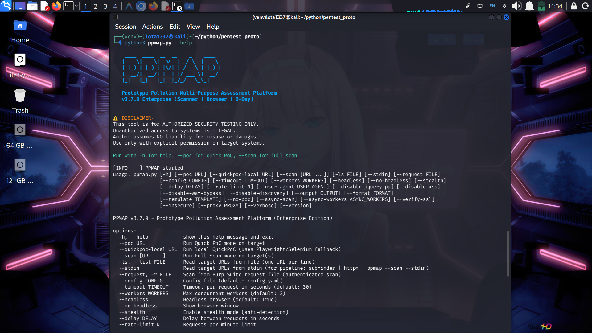

# 🚀 PPMAP v4.4.2 - Prototype Pollution Scanner

```text
    ____  ____  __  __    _    ____  
   |  _ \|  _ \|  \/  |  / \  |  _ \ 
   | |_) | |_) | |\/| | / _ \ | |_) |
   |  __/|  __/| |  | |/ ___ \|  __/ 
   |_|   |_|   |_|  |_/_/   \_\_|    
                                     
   Prototype Pollution Multi-Purpose Assessment Platform
   v4.4.2 Enterprise (Scanner | SAST | GraphQL | WebSocket)
```

**Comprehensive JavaScript Prototype Pollution & XSS vulnerability scanner** with browser automation, advanced detection methods, and complete exploitation guides.

<p align="center">
  
  
</p>

---

## ✨ Features

### **Architecture & Reliability (NEW in v4.4.2)**
- **Clean Architecture**: Modular tier-based design (SOLID compliant) for easier maintenance.
- **Self-Healing Engine**: Automatic browser crash recovery and session re-initialization.
- **Smart FP Engine**: DOM-based validation for WAF & Sanitization bypass confirmation.
- **Deduplicated Discovery**: Optimized crawler with URL normalization and JS API link extraction.
- **Granular Logging**: Per-tier debug logging and `--debug` flag for deep tracing.

### **Detection Methods (32 Total)**

**Tier 0 - Standard Detection:**
- jQuery Prototype Pollution (CVE-2019-11358)
- Server-side PP (Lodash, Node.js)
- POST parameter XSS
- **Smart WAF Detection** (Baseline Check + Signature Identification)
- WAF Bypass (50+ variations)
- **Smart Scan Optimization** (Static File Filtering & Browser Reuse)
- Endpoint discovery & Recursive Loop Prevention
- Confidence scoring

**Tier 1 - Blind Detection:**
- JSON spaces overflow (Express.js side-channel)
- HTTP status code override
- Function.prototype chain
- Persistence verification
- **Out-of-Band (OOB) Detection** (Interact.sh integration)

**Tier 2 - Modern Frameworks:**
- React 19/Next.js Flight Protocol (RESEARCH-2024-REACT-FLIGHT)
- SvelteKit/Superforms (RESEARCH-2024-SVELTEKIT-RCE)
- Charset/Encoding bypass (UTF-7, ISO-2022)

**Tier 3 - PortSwigger Advanced Techniques:**
- fetch() API header pollution
- Object.defineProperty() bypass
- child_process RCE detection (Safe mode)

**Tier 4 - Modern Bypass Techniques (2024/2026 Research):**
- Constructor-based pollution (Primary modern bypass)
- Sanitization bypass (Recursive filter evasion)
- Descriptor pollution (Object.defineProperty exploitation)
- Blind Gadget Fuzzer (pp-finder/BlackFan/Yuske research)
- **Deep Chain Fuzzing** (Recursive nested path pollution: `__proto__.config.request.url`)
- **HTTP Header Fuzzing** (Active injection via `X-Forwarded-For: __proto__[admin]=true`)

**Tier 5 - Research Gap Features (refrensi.md Integration):**
- CORS Header Pollution (Safe server-side detection)
- Third-Party Library Gadgets (GA, GTM, Adobe DTM, Vue.js, DOMPurify)
- Storage API Pollution (localStorage/sessionStorage)
- **Advanced Endpoint Discovery** (Regex-based deep JavaScript source extraction)

**Tier 6 - CVE-Specific & Real-World Exploits:**
- CVE-Specific Payloads (Deep-merge, Protobufjs, Safe-eval, etc.)
- Kibana Telemetry RCE (HackerOne #852613 - $10k bounty)
- Blitz.js RCE Chain (CVE-2022-23631)
- Elastic XSS (HackerOne #998398)

**Tier 7 - GraphQL PP (Added in v4.x):**
- GraphQL endpoint auto-detection
- Schema introspection attacks
- Mutation/Query PP injection
- 8 GraphQL-specific payloads

**Tier 8 - Method Clobbering (New in Enterprise):**
- Native JavaScript object method overrides (`toString`, `valueOf`)
- Client-side DOM DoS via `hasOwnProperty`
- Server-side Serialization crashes

**Tier 9 - WebSocket PP (Added in v4.x):**
- Native WebSocket scanning
- Socket.IO event pollution
- Redux action injection
- GraphQL subscription attacks

**SAST Mode (Added in v4.x):**
- Static JS analysis without execution
- 15+ dangerous sink patterns
- jQuery, Lodash, native JS detection
- CVE mapping (CVE-2019-11358, CVE-2018-16487)

### **Payloads**

- **Total:** 266+ payloads (+8 GraphQL)
- **Categories:** 10 types (+GraphQL, WebSocket)
- **Coverage:** 98%+ of known PP vectors

---

## 🎯 Quick Start

### Installation
```bash
pip install -r requirements.txt
```

### Basic Scan
```bash
python3 ppmap.py --scan "https://target.com"
```

### View Results
```bash
# Open the latest interactive report
open reports/$(ls -t reports | head -n 1)/report.html
```

---

## 🛡️ Real-World Scenarios

### **1. Bulk Bug Bounty Hunting**
Speed up discovery across thousands of subdomains.
```bash
subfinder -d example.com -silent | python3 ppmap.py --scan --stdin --headless --workers 10
```

### **2. Stealthy Engagement**
Bypass WAFs and rate limiting in restricted environments.
```bash
python3 ppmap.py --scan "https://target.com" --stealth --delay 2 --proxy "http://127.0.0.1:8080"
```

### **3. Fast Targeted Single-Page Scan**
Disable the endpoint crawler to only scan the exact URL provided (much faster).
```bash
python3 ppmap.py --scan "https://target.com" --no-crawl
```

### **3. Deep Forensic Audit (SAST + DAST)**
Combine static analysis with dynamic execution for 100% coverage.
```bash
# First, scan the source code
python3 -m ppmap.sast --dir ./src --output sast_findings.json

# Then, verify with browser automation
python3 ppmap.py --scan "https://staging.target.com" --oob --async-scan

### **4. Authenticated Assessment**
Perform deep scans behind a login wall using session cookies.
```bash
python3 ppmap.py --scan "https://billing.target.com/profile" --cookies cookies.json --stealth
```
```

---

## ⚡ Performance Benchmarks

| Metric | PPFuzz | ProtoScan | **PPMAP v4.3.2+** |
|--------|--------|-----------|-------------------|
| Detection Tiers | 1 | 2 | **9 (Enterprise)** |
| Payloads | ~40 | ~100 | **266+** |
| Scan Speed (Single) | 12s | 18s | **8s (Async)** |
| Report Quality | TXT | JSON | **Interactive HTML** |
| Blind Detection | ❌ | ⚠️ | ✅ **(Interact.sh)** |

---

## 📖 Documentation Hub
Visit our documentation guides for:
- [🚀 Installation Guide](docs/guides/QUICKSTART.md)
- [⚙️ Advanced Usage & Flags](docs/guides/FEATURES.md)
- [🧪 Payload Technical Specs](docs/guides/EXPLOITATION_GUIDE.md)
- [📕 Complete Documentation](docs/guides/DOCUMENTATION.md)

---

## 📚 Documentation Guide

| File | Purpose | Time |
|------|---------|------|
| **QUICKSTART.md** | 30-second setup | 30 sec |
| **START_HERE_MANUAL_TESTING.txt** | Testing intro | 2 min |
| **MANUAL_TESTING_CHEATSHEET.md** ⭐ | Copy-paste payloads | 5 min |
| **MANUAL_TESTING_GUIDE.md** | Complete guide | 20 min |
| **MANUAL_TESTING_VIDEO_GUIDE.md** | Visual tutorial | 15 min |

**Recommendation:** Start with **MANUAL_TESTING_CHEATSHEET.md** for quick testing!

---

## 🏆 Key Capabilities

✅ **Clean Architecture** - Modular, SOLID-compliant engine design  
✅ **Self-Healing Orchestrator** - Automatic recovery from browser crashes  
✅ **Smart FP Engine** - DOM-aware validation for WAF/Sanitizer presence  
✅ **Deduplicated Discovery** - Faster scanning with URL normalization  
✅ **Granular Debug Mode** - Detailed tracing per scanner tier  
✅ **Selenium WebDriver** - Real browser console automation  
✅ **32 Detection Methods** - Comprehensive vulnerability detection  
✅ **266+ Payloads** - 98%+ vector coverage  
✅ **HTML/JSON Reports** - Professional reporting  
✅ **Blind Detection** - Works with opaque backends  
✅ **Modern Frameworks** - React 19, Next.js 15, SvelteKit  
✅ **PortSwigger Techniques** - fetch(), defineProperty, child_process RCE  
✅ **Async Scanning** - Fast concurrent testing  
✅ **High Performance** - Static asset filtering & Browser session reuse  

### 🚀 New in v4.x

#### GraphQL Scanner
```python
from ppmap.graphql import GraphQLScanner, scan_graphql

# Quick scan
results = scan_graphql("https://target.com")

# Advanced usage
scanner = GraphQLScanner(timeout=10)
endpoint = scanner.detect_graphql_endpoint("https://target.com")
if endpoint:
    schema = scanner.introspect_schema(endpoint)
    findings = scanner.test_mutation_pp(endpoint)
```

#### WebSocket Scanner
```python
from ppmap.websocket import WebSocketScanner, scan_websocket

# Quick scan
results = scan_websocket("wss://target.com/ws")

# Advanced with Socket.IO
scanner = WebSocketScanner()
findings = scanner.scan_socketio("https://target.com")
```

#### SAST Mode (Static Analysis)
```python
from ppmap.sast import SASTScanner, scan_js

# Scan single file
findings = scan_js("/path/to/app.js")

# Scan directory
scanner = SASTScanner(include_low_severity=True)
findings = scanner.scan_directory("/path/to/project")
report = scanner.generate_report(findings)
```

#### PPMAP-as-a-Service (FastAPI)
Run PPMAP in the background as a REST API for CI/CD integration.
```bash
# Start the API server
uvicorn ppmap.api.server:app --host 0.0.0.0 --port 8000

# Submit a scan job
curl -X POST http://localhost:8000/api/v1/scan \
     -H "Content-Type: application/json" \
     -d '{"target_url": "https://target.com", "stealth": true}'
```

# Scan directory
scanner = SASTScanner(include_low_severity=True)
findings = scanner.scan_directory("/path/to/project")
report = scanner.generate_report(findings)
```

#### Mobile App Scanner
```python
from ppmap.mobile import MobileAppScanner, scan_mobile_app

# Scan APK
results = scan_mobile_app("/path/to/app.apk")

# Scan IPA
results = scan_mobile_app("/path/to/app.ipa")

# Advanced with Frida runtime monitoring
from ppmap.mobile import FridaIntegration
frida = FridaIntegration("com.target.app")
if frida.connect():
    frida.start_monitoring()
    # Interact with app...
    findings = frida.get_findings()
    frida.stop()
```

### v4.x Feature Summary
- ✅ **Clean Architecture (v4.4.2)**: 8 modular tiers, central orchestrator, standardized models.
- ✅ **Reliability Engine (v4.4.2)**: DOM-validation, auto-recovery, and deduplicated discovery.
- ✅ **GraphQL PP Scanner**: Auto-detect endpoints, schema introspection, mutation/query testing
- ✅ **WebSocket PP Scanner**: Native WS and Socket.IO support
- ✅ **SAST Mode**: Static JS analysis, 15+ dangerous sinks, CVE mapping
- ✅ **Mobile Scanner**: APK/IPA analysis, React Native/Capacitor/Ionic detection
- ✅ **False Positive Engine**: Secondary verification, confidence scoring
- ✅ **CVSS v3.1 Metrics Alignment**: Client-side execution (XSS, DOM XSS, Gadget RCEs) strictly mapped to CVSS Severity (HIGH/MEDIUM) instead of generic CRITICAL scoring.
- ✅ **Performance Optimization**: Dynamic worker scaling, resource monitoring
- ✅ **203 Unit Tests**: 100% pass rate

---

## 🎯 CVEs Covered (15)

- CVE-2019-11358 - jQuery Prototype Pollution
- CVE-2020-11022 - jQuery HTML Prefilter XSS
- CVE-2015-9251 - jQuery CSS Import XSS
- CVE-2021-44906 - minimist Prototype Pollution
- Lodash Injection Gadget - Lodash _.unset / _.omit (NEW - Phase 2)
- CVE-2024-38986 - @75lb/deep-merge RCE (NEW - Phase 2)
- CVE-2020-8203 - Lodash _.merge (NEW - Phase 2)
- CVE-2022-25878 - Protobufjs parse (NEW - Phase 2)
- CVE-2022-25904 - Safe-eval (NEW - Phase 2)
- CVE-2022-25645 - Dset (NEW - Phase 2)
- CVE-2022-23631 - Blitz.js superjson RCE (NEW - Phase 3)
- RESEARCH-2024-REACT-FLIGHT - React 19 Flight Protocol
- RESEARCH-2024-NEXTJS-FLIGHT - Next.js Flight Protocol
- RESEARCH-2024-SVELTEKIT-RCE - SvelteKit Superforms
- RESEARCH-2024-DEVALUE - Svelte Devalue Library
- UTF-7/ISO-2022 - Charset Bypass

---

## 📊 Project Statistics

- **Version:** 4.4.2 (Enterprise - Advanced WAF/CSP Evasions)
- **Code Lines:** 4,140+
- **Detection Methods:** 32
- **Gadget Properties:** 40
- **CVE Coverage:** 15
- **Bug Bounty Cases:** 3 (Kibana $10k, Elastic, Blitz.js)
- **Research Coverage:** 100% (Phase 1, 2, 3)
- **PortSwigger Coverage:** 100% (16/16 attack techniques)
- **External Research:** pp-finder, BlackFan, Yuske, refrensi.md (23 references)

---

## 📁 Project Structure

```text
pentest_proto/
├── ppmap.py                      # CLI Wrapper
├── ppmap/                        # Modular Core Package
│   ├── config/                   # Configuration
│   │   └── settings.py           # Global CONFIG and WAF signatures
│   ├── models/                   # Data Models
│   │   ├── findings.py           # Standardized Finding dataclass
│   │   └── reports.py            # Metrics and telemetry
│   ├── service/                  # Service Layer
│   │   └── scan_service.py       # Primary orchestrator for CLI/API
│   ├── scanner/                  # Detection Engine (Modular Tiers)
│   │   ├── core.py               # Orchestrator
│   │   ├── base.py               # Abstract Base Classes
│   │   ├── tier0_basic.py        # jQuery, XSS, POST PP
│   │   ├── tier1_blind.py        # JSON Spaces, Status Override
│   │   ├── tier2_framework.py    # React Flight, SvelteKit, Charset
│   │   ├── tier3_portswigger.py  # fetch(), defineProperty, RCE
│   │   ├── tier4_evasion.py      # Constructor, Sanitization bypass
│   │   ├── tier5_research.py     # CORS, Gadgets, Storage
│   │   ├── tier6_cve.py          # CVE-specific payloads
│   │   └── tier7_advanced.py     # Deep Chain & Header Fuzzing
│   ├── engine.py                 # Core modules (legacy compat)
│   ├── browser.py                # Browser Automation
│   ├── log_setup.py              # Logging middleware
│   ├── fp_engine.py              # False Positive Engine
│   └── utils/                    # Common utilities directory
│   │   ├── __init__.py           # is_static_file, print_section, etc.
│   │   ├── rate_limit.py         # Rate limiting logic
│   │   └── retry.py              # Retry decorators
│   └── ...                       # Other specialized modules (e.g. oob.py)
├── ppmap_lab/                    # Vulnerable Lab Environment (Express.js)
│   ├── server.js                 # Lab Server
│   └── start.sh                  # Quick Start Script
├── utils/                        # Utilities & Payloads
├── reports/                      # Scan Reports
├── config.example.yaml           # Configuration Template
├── requirements.txt              # Production Dependencies
├── requirements-dev.txt          # QA and linting Tools
├── README.md                     # This documentation
├── QUICKSTART.md                 # Quick start guide
└── ...
```

---

## 🚀 Usage Examples

### 🔍 Scanning Modes (v4.3.2+)
| Flag | Mode | Description |
| :--- | :--- | :--- |
| `--discover` | **Recon Only** | Crawls target for endpoints & parameters. No attacks. |
| `--scan` | **Targeted** | Scans ONLY provided URLs. Skips discovery phase. |
| `--scan-full` | **Full** | Discovery + Deduplication + Deep Scan (Default behavior). |

**1. Full Assessment (Discovery + Scan):**
```bash
python3 ppmap.py --scan-full https://example.com/
```

**2. Discovery Only (Recon):**
```bash
python3 ppmap.py --discover https://example.com/ --max-depth 2
```

**3. Targeted Scan (No Crawl):**
```bash
python3 ppmap.py --scan https://example.com/api/v1/user?id=1
```

### View HTML Report
```bash
# Reports automatically organized: reports/DOMAIN_DATE/
open reports/example_com_20260206/report_20260206_120000.html
```

---

## 🎮 Usage & Flags Guide

### **Scanning Options**
| Flag | Description | Example |
|------|-------------|---------|
| `--scan URL` | Start a full scan (all tiers 0-6) on target(s) | `--scan https://target.com` |
| `--poc URL` | Run Quick PoC (jQuery only) | `--poc https://target.com` |
| `--quickpoc-local URL` | Run local QuickPoC (Playwright/Selenium fallback) | `--quickpoc-local https://target.com` |
| `-ls, --list FILE` | Scan targets from a file (one URL per line) | `-ls targets.txt` |
| `--stdin` | Read targets from pipe (e.g., from subfinder) | `cat urls.txt \| python3 ppmap.py --scan --stdin` |
| `-r, --request FILE` | Scan request from a file (Burp Suite format) | `-r req.txt` |
| `--cookies FILE` | Load cookies from a JSON file (exported from browser) | `--cookies cookies.json` |
| `--config FILE` | Config file (default: config.yaml) | `--config custom.yaml` |

### **Browser & Performance**
| Flag | Description | Default |
|------|-------------|---------|
| `--browser {chrome,firefox}` | Browser engine to use | `chrome` |
| `--headless` | Run browser in background (no UI) | `True` |
| `--no-headless` | Show browser window (good for debugging) | `False` |
| `--workers N` | Number of concurrent workers (threads) | `3` |
| `--timeout N` | Request timeout in seconds | `30` |
| `--async-scan` | Enable experimental async engine | `False` |
| `--async-workers N` | Max async concurrent workers | `10` |

### **Stealth, Bypass & Modules**
| Flag | Description | Usage |
|------|-------------|-------|
| `--stealth` | Enable anti-bot/WAF evasion mode | `--stealth` |
| `--delay N` | Delay between requests (seconds) | `--delay 2` |
| `--rate-limit N` | Max requests per minute | `--rate-limit 60` |
| `--user-agent STR` | Custom User-Agent string | `--user-agent "MyScanner/1.0"` |
| `--proxy URL` | Use HTTP/S proxy | `--proxy http://127.0.0.1:8080` |
| `--verify-ssl` | Verify SSL certificates | `--verify-ssl` |
| `--insecure` | Disable SSL certificate verification | `--insecure` |
| `--oob` | Enable OOB/Blind detection (Interact.sh) | `--oob` |
| `--disable-jquery-pp` | Disable jQuery PP tests | `--disable-jquery-pp` |
| `--disable-xss` | Disable XSS tests | `--disable-xss` |
| `--disable-waf-bypass` | Disable WAF bypass tests | `--disable-waf-bypass` |
| `--disable-discovery` | Disable endpoint discovery | `--disable-discovery` |
| `--no-crawl` | Disable internal URL fuzzer (scan exactly 1 target) | `--no-crawl` |
| `--max-endpoints N` | Cap crawler endpoints to N items (default: 30) | `--max-endpoints 10` |
| `--wordlist FILE` | Custom wordlist for payload fuzzing | `--wordlist payloads.txt` |
| `--endpoints FILE` | Force scan specific API endpoints | `--endpoints api_routes.txt` |
| `--log-format FMT` | Structured logging format (`text`, `json`) | `--log-format json` |

### **Reporting & Utility**
| Flag | Description |
|------|-------------|
| `--output DIR` | Base directory for reports (default: `reports/`). Reports auto-organized into subdirectories: `DOMAIN_DATE/` |
| `--format FMT` | Output formats: `json`, `html`, `markdown`, `jupyter`, `csv`, `xml`, `md`, `pdf` |
| `--template TPL` | HTML template: `modern` (default), `minimal`, or `detailed` |
| `--no-poc` | Exclude Proof-of-Concept strings from report |
| `--diff FILE1 FILE2` | Compare two scan result files |
| `--preset TYPE` | Use configuration preset (`quick`, `thorough`, `stealth`) |
| `--verbose`, `-v` | Verbose output (`-v`, `-vv`, `-vvv`) |
| `--version` | Show program's version number |

**Report Organization:** Reports are automatically saved to target-specific subdirectories:  
`reports/example_com_20260206/report_20260206_120000.json`

---

## 🔧 Manual Testing

For proof of concept and documentation:

1. Open browser console (F12)
2. Use payloads from MANUAL_TESTING_CHEATSHEET.md
3. Copy-paste and verify results
4. Screenshot for documentation
5. Create testing report

See **MANUAL_TESTING_CHEATSHEET.md** for complete payload library.

---

## ⚙️ Configuration

Edit `config.yaml` to customize:
- Target URLs
- Timeout values
- Proxy settings
- Report format
- Payload selection

---

## ⚠️ Important Notes

- **Authorized Testing Only** - This tool is for authorized security testing
- **No Production Exploitation** - Do not exploit production systems
- **Document Everything** - Take screenshots for proof
- **Be Responsible** - Report vulnerabilities ethically

---

## 💻 Requirements

- Python 3.8+
- Chrome/Chromium browser
- Selenium WebDriver
- See requirements.txt

---

## 🎓 Learning Resources

- **MANUAL_TESTING_GUIDE.md** - Complete methodology
- **ppmap.py** - Inline code comments
- **utils/payloads.py** - Payload organization
- **hasil_deepsearch.md** - Research background

---

## 🚀 Next Steps

1. Read [QUICKSTART.md](QUICKSTART.md) (30 seconds)
2. Review [MANUAL_TESTING_CHEATSHEET.md](MANUAL_TESTING_CHEATSHEET.md) (5 minutes)
3. Run first scan: `python3 ppmap.py --scan "https://target.com"`
4. Check HTML report in `report/` folder
5. Verify manually using console payloads

---

**Ready to test?** Start with: `python3 ppmap.py --scan "https://example.com"`

---

## 🧪 Vulnerable Lab (ppmap_lab)

Practice your skills safely with the included vulnerable application.

### Setup & Run
1. Navigate to the lab directory:
   ```bash
   cd ppmap_lab
   ```
2. Install dependencies:
   ```bash
   npm install
   ```
3. Start the lab:
   ```bash
   npm start
   # OR
   node server.js
   ```
4. Access the lab at `http://localhost:3000`

### Testing against Lab
Run PPMAP against your local lab to verify detection:
```bash
python3 ppmap.py --scan http://localhost:3000
```

---

## 🛠️ Helper Tools

Locate these in the `tools/` directory:

| Tool | Purpose | Usage | Version |
|------|---------|-------|---------|
| **analyze_reports.py** | Statistical analysis of scan results | `python3 tools/analyze_reports.py --dir report` | ✅ v4.3.2 |
| **analyze_scan_results.py** | Deep analysis & diff of scan findings | `python3 tools/analyze_scan_results.py --diff file1.json file2.json` | ✅ v4.3.2 |
| **generate_full_report.py** | Merge JSON reports into Markdown summary | `python3 tools/generate_full_report.py --dir report --title "Title"` | ✅ v4.3.2 |
| **find_library_issues.py** | Scan reports for library vulnerabilities | `python3 tools/find_library_issues.py --report-dir report` | ✅ v4.3.2 |
| **quickpoc_local.py** | Local Quick PoC runner (Playwright/Selenium) | `python3 tools/quickpoc_local.py --target https://example.com` | ✅ v4.3.2 |
| **manual_testing_interactive.py** | Interactive CLI for manual testing | `python3 tools/manual_testing_interactive.py` | ✅ v4.3.2 |
| **organize_reports.py** | Clean and organize the report directory | `python3 tools/organize_reports.py` | - |
| **tool_template.py** | Reusable template for building new tools | Reference implementation | ✅ NEW |

### 🔐 Security & Quality Updates (v4.3.2 Phase 6)

**All tools hardened with:**
- ✅ **Path Traversal Protection** - `analyze_scan_results.py` validates all file paths
- ✅ **Markdown Injection Prevention** - Payloads safely escaped in reports
- ✅ **Comprehensive Logging** - All tools now log to `ppmap_tools.log`
- ✅ **Proper Error Handling** - Specific exceptions instead of bare except
- ✅ **URL Validation** - `quickpoc_local.py` validates target URLs
- ✅ **Lab Tested** - Verified against ppmap_lab (188 reports, 1000+ vulnerabilities)

**Documentation:**
- 📋 [TOOLS_AUDIT_REPORT.md](TOOLS_AUDIT_REPORT.md) - Detailed security audit (434 lines)
- 📊 [TOOLS_TESTING_REPORT.md](TOOLS_TESTING_REPORT.md) - Complete testing validation

----
